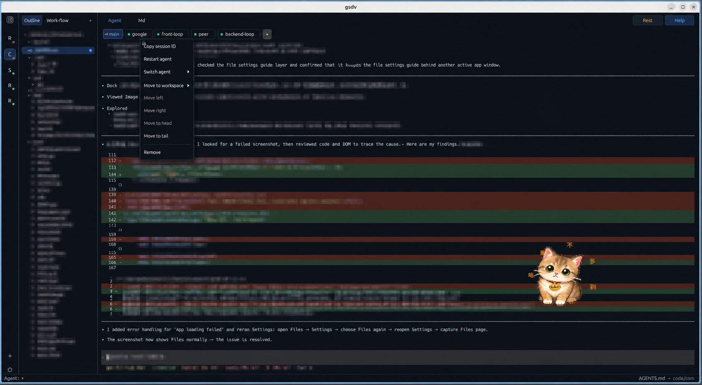
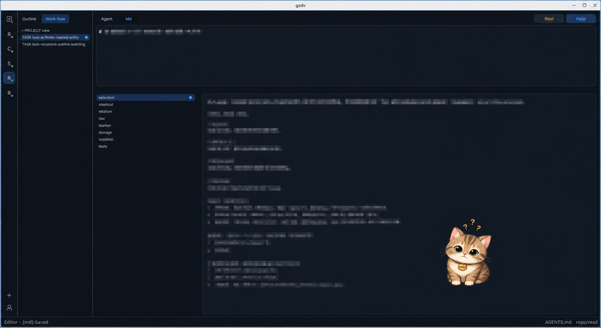
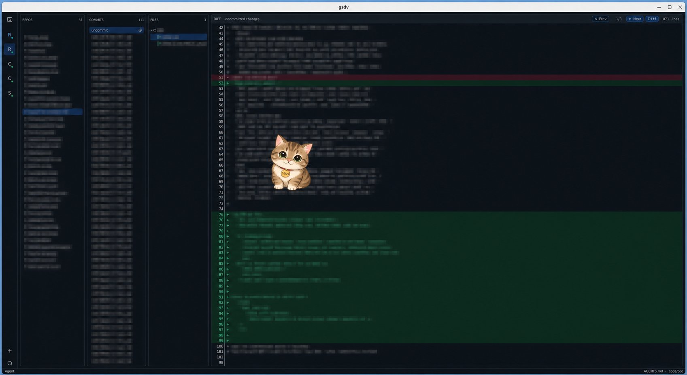

# gsdv

`gsdv` is a native desktop workspace for agent-centered development.

<p align="center">
  
</p>

<p align="center">
  <strong>Agent-first workspace shell</strong><br />
  Keep the active agent, subagents, project notes, and review context in one persistent desktop surface.
</p>

| Work-flow keeps project intent editable | Reviewer keeps implementation changes inspectable |
| --- | --- |
|  |  |

It keeps the coding agent, project notes, implementation workflow, repository review, and workspace shell inside one focused app window. The goal is not to become a general IDE. The goal is to keep the operational context around an AI-assisted project visible, editable, and reviewable while work is happening.

The current integration focus is Codex. Claude-compatible paths still exist where they are useful, but the most actively shaped workflows, defaults, and hook integrations are optimized around Codex sessions.

```text
workspace rail | outline / work-flow | active workspace surface
```

## Product Position

Modern agent work creates a coordination problem. The useful context is split across the agent terminal, Markdown notes, task plans, git history, review artifacts, shell commands, and small local scripts. `gsdv` treats those as one workspace instead of separate windows.

The app is built around three ideas:

- the workspace is the unit of isolation
- the agent is the primary working surface
- project knowledge and review state should stay close to the agent

This makes `gsdv` closer to a project cockpit than an editor. It is dense, stateful, and meant to stay open for long sessions.

## Workspace Model

Each workspace owns a complete context bundle:

- one primary agent session
- one persistent workspace terminal
- one Markdown outline and active document state
- one `gsdv-spec` workflow tree
- one reviewer state for GSD and Git inspection
- its own dialogs, notifications, recent files, favorites, and runtime state

Switching workspaces swaps the entire bundle. A terminal, agent session, selected Markdown file, workflow selection, and reviewer position belong to their workspace, not to the global window.

## Primary Workflows

### Run The Agent

The agent surface embeds a real terminal backend and launches the selected coding agent from the workspace root by default. It supports resumable sessions, subagents, translated input drafts, quick replies, status hooks, and activity-aware UI state.

Each agent tab can carry its own optional launch settings, including model, Codex model provider, effort, fast mode where supported, and work directory. Work directory overrides are agent-scoped and persisted with the workspace. They can be typed directly or filled from a folder picker, and an empty value falls back to the workspace root. The child process is launched in that directory instead of passing a directory flag through the agent CLI, so Codex and Claude use the same behavior.

Codex status hooks feed the workspace activity state directly into the app through the local hook socket. This avoids polling the status file during active sessions while keeping the persisted file as a startup fallback.

The agent surface is the workspace home. Other surfaces exist to feed context into it, inspect its results, or maintain the project plan around it.

### Maintain Project Knowledge

The Markdown outline gives fast access to workspace documentation, attached local directories, and supported home-root Markdown sources. The center surface can edit Markdown directly or render it as preview. Recent Markdown history and diff context help move information between notes and the agent without leaving the app.

Outline directory menus can attach another local directory beside the workspace root, remove an attached directory without deleting it, create Markdown files, and create folders. New folder dialogs focus the name field immediately and accept Enter to create, keeping the file-management path keyboard friendly.

### Drive Work From `gsdv-spec`

The Work-flow tab reads `./gsdv-spec` and turns it into a project/task/step tree. It is intentionally lightweight: task files are Markdown, task descriptions are Markdown, and each step is a level-2 checkbox heading. Task files use the `task-*.md` convention so workflow content stays easy to identify in a normal repository tree.

A task opens a focused task surface:

```text
task description editor
steps list | selected step editor
```

This keeps intent and implementation notes in the same file. The UI edits the task description and selected step description together, then writes them back to the task Markdown.

Workflow paths can be copied in a stable `project > task > step` form, and keyboard shortcuts can switch between the agent and the active workflow surface so implementation notes stay close to the running session.

### Review What Changed

Reviewer is a full route, not a side panel. It replaces the normal outline and center surface with a dense inspection view for GSD provenance and Git state.

In Git mode, the reviewer is organized around repositories, commits, files, and diff/full-file content. In GSD mode, it is organized around change groups, repositories, files, and diff/full-file content. Reviewer rows can produce agent-ready prompt text so review observations can go back into the agent quickly.

Reviewer targets can also open directly in the embedded Helix drawer, rooted in the target repository.

### Navigate Code With Helix

`gsdv` embeds Helix as a mature editor surface instead of trying to become a code editor itself. Agent output that contains `file:line` or `file:line-line` can open Helix at the target file and line. Reviewer selections can open Helix in the matching repository, and general workspace Helix opens reuse the active workspace root.

Agent file-line opens are tracked in a short in-memory recent list. The list keeps the latest targets first, deduplicates by workdir, file, and line, and can be reopened from a centered modal.

Inside the embedded Helix surface, `Alt+D` and `Cmd+D` can send the current `file:line` back through the app hook socket. The app copies that location and pastes it into the active agent input, leaving it ready for the next prompt.

### Keep A Workspace Shell

Each workspace has a persistent terminal separate from the agent. It stays rooted in the workspace and can be left and resumed like any other workspace surface.

### Attach Local Tools

Small shell scripts can be surfaced as extra tools. They can live globally or in a workspace, expose card or switch style controls, take input, and route output into the app notification stream.

Reviewer scripts are context-aware actions for the reviewer surface. They are useful for local repo checks, branch-specific scripts, or project-specific review automation.

## `gsdv-spec`

`gsdv-spec` is the project workflow convention used by the Work-flow tab and the bundled `gsdv-wf` skill.

```text
gsdv-spec/
  root.md
  ps/
    <project>/
      root.md
      task-*.md
```

`gsdv-spec/root.md` describes the whole spec. Each project directory has its own `root.md`. Task files are plain Markdown:

```md
Task-level description before the first step.

## [x] Implement storage path
Step description.

## [ ] Handle restore flow
Step description.
```

Rules:

- content before the first valid step heading is the task description
- a valid step heading is `## [ ] title`, `## [x] title`, or `## [X] title`
- step titles are one line and may contain spaces or non-English text
- step descriptions continue until the next valid step heading
- there are no nested workflow steps in the current format
- logical paths copy as `project > task > step`

The format is deliberately plain Markdown so it remains readable without `gsdv`.

## Integration Model

`gsdv` installs local integration assets for the current user:

- an agent status hook under `~/.gsdv/hooks`
- the bundled `gsdv-wf` skill for Codex and Claude skill directories
- a process-local hook endpoint used by Codex status hooks and embedded Helix actions

The app stores runtime state under `~/.gsdv`: workspace metadata, recent documents, favorites, settings, agent status, notifications, reviewer scripts, and extra tools.

Network proxy settings can be applied to newly launched agents, terminals, Helix, and scripts. This keeps external process behavior aligned with the app environment.

The hook endpoint is a Unix domain socket on Linux and macOS, and a named pipe on Windows. Messages use a small length-prefixed frame with a `key:data` payload so the same channel can carry agent status updates, Helix cursor-location actions, and future local integrations.

## Operating Model

`gsdv` is a single-process `egui` / `eframe` desktop app.

The important product consequence is that terminal output, file watching, reviewer refresh, document saves, screenshots, script output, and UI input all stay coordinated through one app state model. Visible UI state changes flow through a single `AppEvent` queue. Slow work is pushed out of the UI event drain and returns through events.

Terminal surfaces use direct `alacritty_terminal` integration. The app does not rely on tmux, Ratatui panes, terminal screenshots, or legacy TUI compatibility layers to compose the product.

Terminal repaint is gated so hidden or inactive terminal surfaces do not create repaint storms. Modern TUI keyboard protocols are forwarded where possible, which lets embedded Helix and Codex receive modified keys such as Alt and Cmd combinations instead of having the app swallow them.

## Product Boundaries

`gsdv` intentionally does not try to be:

- a general code editor
- a replacement for a full IDE
- a terminal multiplexer
- a generic task manager
- a project management SaaS surface

It is designed for a narrower loop:

```text
plan in Markdown
run the agent
inspect changes
update intent
review again
```

That loop is why the app keeps Agent, Markdown, Work-flow, Reviewer, Terminal, notifications, and local tools in one workspace shell.

## Design Stance

`gsdv` favors dense, quiet, repeatable desktop workflows. The center surface is intentionally dominant. The rail and outline keep workspace identity and project knowledge nearby without competing with the active work.

The interface should be fast to scan, keyboard-friendly, explicit about state, and stable during long-running agent or review sessions.

Optional pomodoro focus mode adds a visual gravity-lens rest effect around the workspace. It is designed as a break-state cue, not as a separate productivity dashboard.
